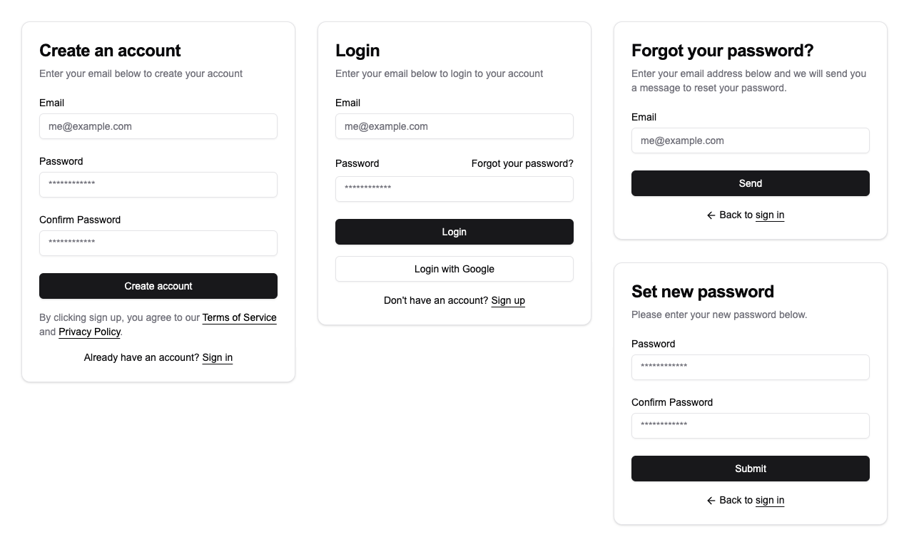

# nextjs14-supabase-dashboard

This is a dashboard starter template for the [NextJS](https://nextjs.org) 14 based on [Supabase](https://supabase.com).

## Screenshots



## Denpendencies

- Next.js 14
- Tailwindcss
- Shadcn
- Supabase Auth + Supabase CLI
- Prisma
- Zustand
- React Query
- Jose
- Nodemailer
- Browserslist
- dayjs
- qs
- cookies-next

## Folder and file Structure

The folder and file structure is based on nextjs app router [next.js project structure](https://nextjs.org/docs/getting-started/project-structure).

```txt
.
├── actions/                    # Server Actions
├── app/                        # App Router
│   └── api/
│       ├── auth/               # Authentication
│       └── v1/                 # Public APIs
├── components/                 # React components
├── config/                     # Configuration for site
├── context/                    # Context
├── docs/                       # Documents
├── hooks/                      # Hooks
├── lib/                        # Application specific libraries & Utility functions
├── prisma/                     # Prisma Schema Location and Configuration
├── public/                     # Static assets to be served
│   └── [locales]/              # Internationalization
├── queries/                    # APIs
├── schemas/                    # Schema validations
├── screenshots/                # Screenshots
├── store/                      # State
├── supabase/                   # Supabase CLI
├── types/                      # Type definitions
└── package.json
```

## Getting Started

Clone the repository to the current directory.

```shell
git clone https://github.com/w3labkr/nextjs14-supabase-dashboard.git .
```

Install all modules listed as dependencies.

```shell
npm install
```

Copy of the `.env.example` if the `.env` doesn't exist.

```shell
cp .env.example .env
```

Create an SQL migration file and execute it.

```shell
npx prisma migrate dev --name init
```

Start the development server.

```shell
npm run dev
```

## Documents

- [DEPENDENCIES](./docs/DEPENDENCIES.md)
- [GIT](./docs/GIT.md)
- [PRISMA](./docs/PRISMA.md)
- [SUPABASE](./docs/SUPABASE.md)

## CSRF

> All Server Actions can be invoked by plain `<form>`, which could open them up to CSRF attacks. Behind the scenes, Server Actions are always implemented using POST and only this HTTP method is allowed to invoke them. This alone prevents most CSRF vulnerabilities in modern browsers, particularly due to Same-Site cookies being the default.
>
> As an additional protection Server Actions in Next.js 14 also compares the Origin header to the Host header (or X-Forwarded-Host). If they don't match, the Action will be rejected. In other words, Server Actions can only be invoked on the same host as the page that hosts it. Very old unsupported and outdated browsers that don't support the Origin header could be at risk.
>
> Server Actions doesn't use CSRF tokens, therefore HTML sanitization is crucial.
>
> When Custom Route Handlers (route.tsx) are used instead, extra auditing can be necessary since CSRF protection has to be done manually there. The traditional rules apply there.

[How to Think About Security in Next.js](https://nextjs.org/blog/security-nextjs-server-components-actions)

## License

This software license under the [MIT License](LICENSE).
